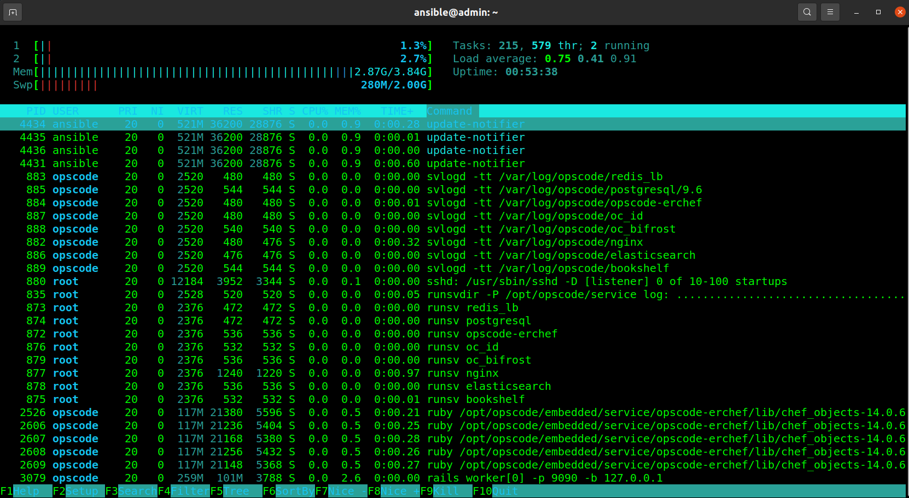
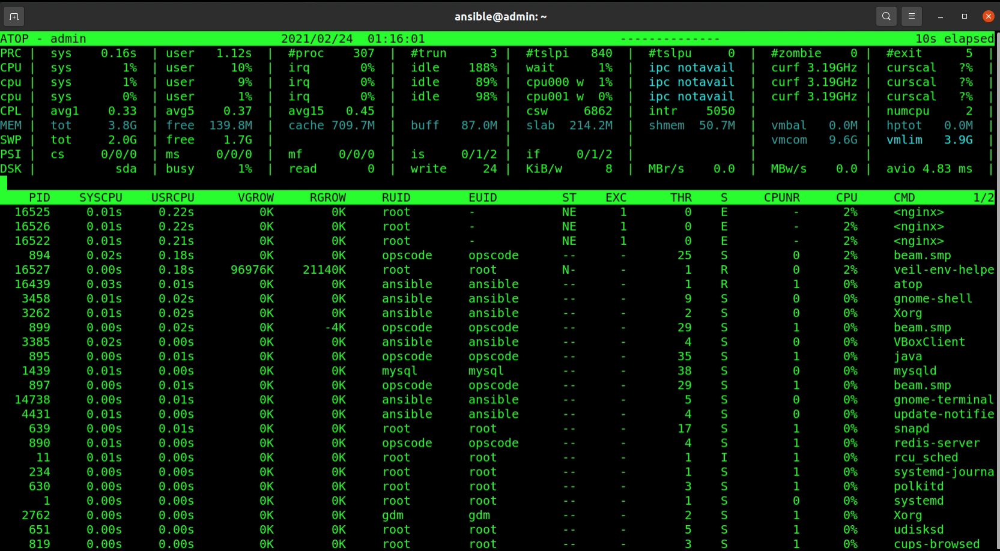
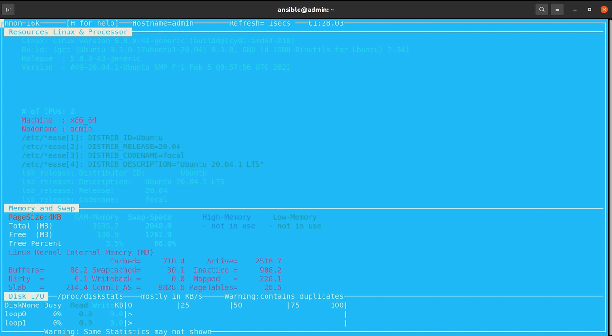
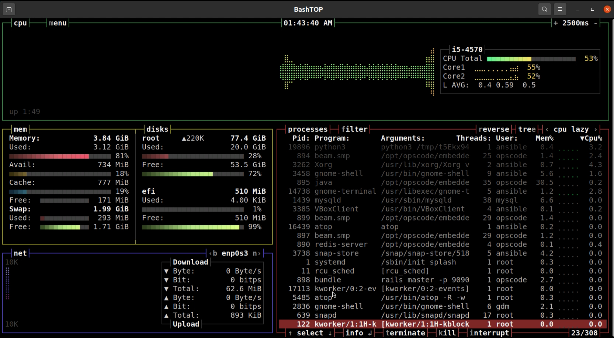
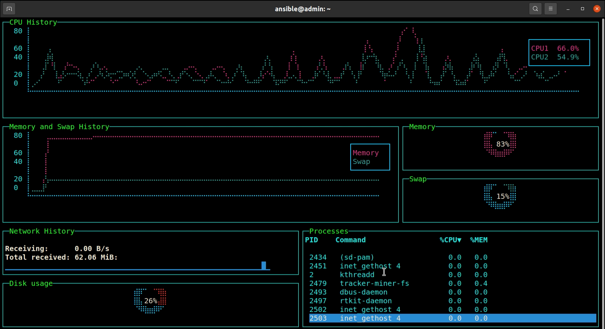

### [Top 7 system monitoring tools]()

`1. htop`

`2. atop`

`3. nmon`

`4. vtop`

`5. bashtop`

`6. gtop`

`7. Glances`

> #### nmon and vtop are my favorite system monitoring tools. They offer user friendly CLI interaction.

#### [Installation file link](https://github.com/simulationpoint/top.7_system_monitoring_tools/blob/main/7sys-monitoring-tools.sh)

